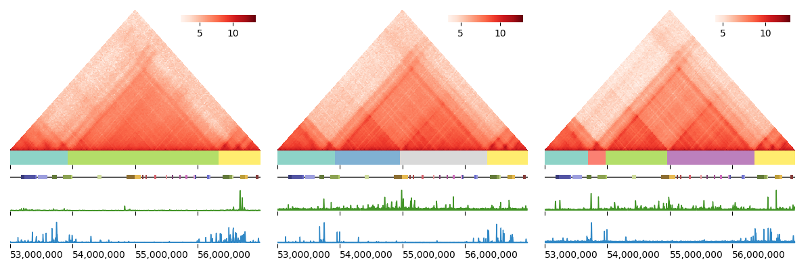

### GRiNCH: Graph-Regularized NMF and Clustering for Hi-C

[](http://perso.crans.org/besson/LICENSE.html)
[](https://github.com/Roy-lab/grinch/releases/tag/v1.0.0)

GRiNCH applies non-negative matrix factorization (NMF) with graph regularization to discover clusters of highly interacting genomic regions from high-throughput chromosome conformation capture (Hi-C) data. GRiNCH can be used to smooth the input matrices, and can be applied to data from any 3D genome platforms (e.g. HiChIP, SPRITE) in a non-negative square matrix format. Now published in Genome Biology: [https://doi.org/10.1186/s13059-021-02378-z](https://doi.org/10.1186/s13059-021-02378-z)

 to a Hi-C or a similar high-throughput 3C matrix to find clusters of densely interacting genomic regions. NMF recovers low-dimensional factors U and V of the input matrix X that can be used to reconstruct the input matrix. As nearby genomic regions tend to interact more with each other, we regularize the factor matrices with a neighborhood graph to encourage neighboring regions to have a similar lower-dimensional representation, and subsequently belong to the same cluster. We cluster the regions by treating one of the factor matrices as a set of latent features and applying k-medoids clustering. The clusters represent topological units such as TADs. The factor matrices can be multiplied together to yield a smoothed  version of the input matrix which is often sparse and noisy.")

### [Step 1] Install 

Installation instructions below were tested in Linux Centos 7 distribution. [GSL (GNU Scientific Library)](https://www.gnu.org/software/gsl/doc/html/index.html) is used to handle matrix- and vector-related operations. 

1. __If you already have GSL installed__, edit the first few lines of the Makefile to point to the correct include and shared library directory, then jump to step 3.
```
#CHANGE PATHS AS NEEDED:
INCLUDE_PATH = ${CONDA_PREFIX}/include
LIBRARY_PATH = ${CONDA_PREFIX}/lib
```
2. __If you do not have GSL installed, or you are not sure__, the easiest way to get it installed is to use [conda](https://anaconda.org/conda-forge/gsl/):
```
conda install -c conda-forge gsl
```
3. Make sure to add the location of the installed shared library to where the compiler/linker will be looking. If you used conda to install GSL to the default location in step 2, run the following command (or add the appropriate path if you already have GSL installed):
```
export LD_LIBRARY_PATH=${LD_LIBRARY_PATH}:${CONDA_PREFIX}/lib
```
4. And let's install! In the same directory you downloaded the code/Makefile (either by cloning the repository or by downloading a release), run:
```
make
```
5. If all went well, you won't get any alarming messages, and you will see an executable named `grinch` created in the same directory. A quick test below will print the manual for grinch:
```
./grinch -h
```

Note: in order to implement NNDSVD initialization of factors, a fast randomized SVD algorithm from [RSVDPACK](https://github.com/sergeyvoronin/LowRankMatrixDecompositionCodes) was used. A minor modification to allow random seed specification was made to the original code from [RSVDPACK](https://github.com/sergeyvoronin/LowRankMatrixDecompositionCodes/tree/master/single_core_gsl_code). This updated code is included under modules/random_svd directory. Compilation of this code is part of the included Makefile; no additional step is necessary for installation.

### [Step 2] Run

#### Basic usage

./grinch input.txt input.bed \[-o output_prefix\] \[-k number_of_clusters\] \[-e expected_size_of_cluster\] \[-n neighborhood_radius\] \[-l regularization_strength\] \[-fgs\]
```
>> ./grinch -h
>> ./grinch Huvec_chr12_25kb.txt Huvec_chr12_25kb.bed -o output/Huvec_chr12_25kb
```

#### Input file format
* Matrix file, tab-delimited, sparse-matrix format, no header 
```
0	0	1000.2
0	1	1201.78
10	1	200.7
...
```
* Bed file, tab-delimited, no header 
```
chr1	50000	75000	0
chr1	75000	100000	1
chr1	100000	125000	2
...
```

#### Parameters

| Position | Parameter | Description | Default Value/Behavior | 
| :---    | :---        | :--- | :--- |
| 1     | input matrix file      | Input matrix file path and name. Tab-delimited, in sparse matrix format, no header, e.g. 0 10 1201.78 | N/A | 
| 2     | input bed file         | Input bed file mapping each index in the input matrix file to a chromosomal coordinate. Tab-delimited, no header, e.g. chr1 50000  75000 0. Note: Bin size/resolution of the Hi-C data is assumed to be the same across all bins. Also, only cis-interactions are handled, i.e. the chromosome for all bins are assumed to be the same. | N/A | 
| optional | -o <output_file_prefix>    | Ouput file path and prefix. Note: will NOT create a directory if the specified directory does not exist. | 'output' | 
| optional | -k <number_of_clusters>  | Number of clusters, an integer value. |  n/(1000000/bin size) where n is the dimension of the symmetric input Hi-C matrix and bin size is the resolution in basepairs, i.e., k is set such hat the expected size of a cluster is 1Mb. | 
| optional | -e <expected_size_of_cluster>  | A different way to specify the number of clusters by the expected size of a cluster, i.e. if -e 500000, k = n/(500KB/bin size), where n is the number of bins in the input matrix. Note: -k will override -e. | 1000000, i.e. k = n / (1Mb/bin size) |  
| optional | -n <neighborhood_radius>  | Neighborhood radius used in regularization graph, in base pairs, and in multiples of resolution. -n 100000 would make neighborhood radius of 4 bins in 25kb resolution, and 4 adjacent regions on either side of a given regions will be used to regularize or 'smooth' the matrix factors. Increase for lower-depth or sparser data, to use more neighbors for smoothing. | 100000 | 
| optional | -l <lambda>  | Strength of regularization. | 1 | 
| optional | -s | Print the smoothed matrix to file,  in tab-delimited sparse matrix format (e.g. 25000 50000 500.3). This file can be large. | Do NOT output smoothed matrix. |
| optional | -f | Print to file the factor U and V. File may be large, since the matrix is written in a dense format, especially for higher-resolution input. | Do NOT output factor matrix. |
| optional | -g | Print to file the graph used in regularization. File may be large, since the matrix is written in a dense format.| Do NOT output graph. |

#### Output files

* File suffixed `.tads` returns a list of putative TADs, each line with the first and last bin of each TAD (inclusive of last bin).
* File suffixed `.log` returns a plain-text file with list of parameter values used and time/memory consumption.
* Optional output file suffixed `.smoothed` returns the smoothed matrix in a tab-delimited sparse matrix format. This file may be large.
* Optional output file suffixed `.U` and `.V` returns the factors U and V respectively, in dense matrix format. File may be large, especially for higher-resolution input. Note that since the input cis-interaction Hi-C matrix is symmetric, U and V are equivalent up to some scaling factor and numerical error.
* Optional output file suffixed `.graph` returns the graph used in regularization. File may be large, since the matrix is written in a dense format.

### [Step 3] Visualize

Refer to our [handy dandy visualization tutorial](https://github.com/Roy-lab/grinch/blob/master/visualization/) to generate images of Hi-C heatmaps, GRiNCH clusters, and other 1D epigenetic signals like the one below:




